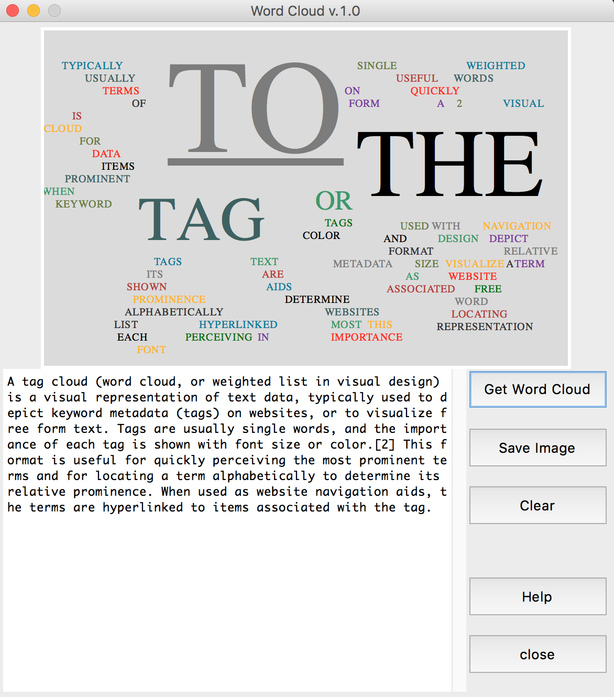

# Simple WordCloud by Python and NLTK

Create by elbanic.(elbanic12@naver.com)

<br><br>

### This software uses the following libraries & platform.
* Python 3.x
* NLTK 3.x

### This software includes the following actions.
* Create WordCloud from input text

<br><br>

## How to run...

#### Installation of dependent libraries.
```
pip3 install nltk
```

#### Run the program
```
git clone https://github.com/elbanic/WordCloud
cd WordCloud
python3 main.py
```

##### Screenshot


<br><br>


##### It uses NLTK © Copyright 2015, NLTK Project. Last updated on Oct 15, 2015. Created using Sphinx 1.3.1.
* GPL
> This program is free software: you can redistribute it and/or modify
it under the terms of the GNU General Public License as published by
the Free Software Foundation, either version 3 of the License, or
(at your option) any later version.
This program is distributed in the hope that it will be useful,
but WITHOUT ANY WARRANTY; without even the implied warranty of
MERCHANTABILITY or FITNESS FOR A PARTICULAR PURPOSE.  See the
GNU General Public License for more details.
You should have received a copy of the GNU General Public License
along with this program.  If not, see <http://www.gnu.org/licenses/>.

